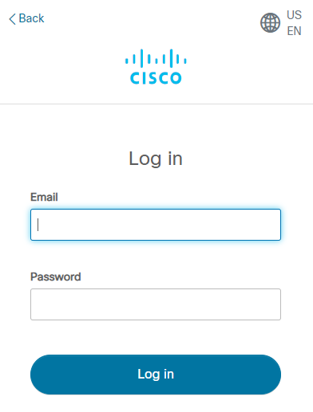
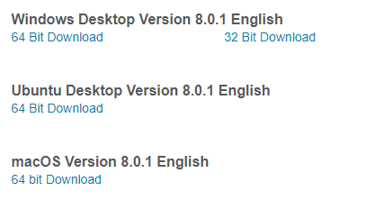

# Installation of Simulation Tools (packet tracer and NS2)

# To install packet tracer:

1. Visit [https://netacad.com/portal/resources/packet-tracer](https://netacad.com/portal/resources/packet-tracer)

2. Login with your NetAcad/Cisco account
   

3. Download Packet tracer for your OS
   

# To install ns2:

1.  Open your ubuntu(>18.01) terminal

2.  Run these commands

        sudo apt-get update
        sudo apt-get dist-update
        sudo apt-get install tclsh nam ns2

3.  To check successful installation of ns2, run the following commands:

        cat > add.tcl << EOF
        set a 1
        set b 2
        set c [expr $a + $b]
        puts $c # ouput will be 3
        EOF
