<!-- show image 1.png -->

# Configure the LAN using Cisco Packet Tracer.

## Step 1: Open Cicso Packet Tracer

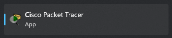

## Step 2: Create a Router 2901

|          How?          |         Result         |
| :--------------------: | :--------------------: |
| 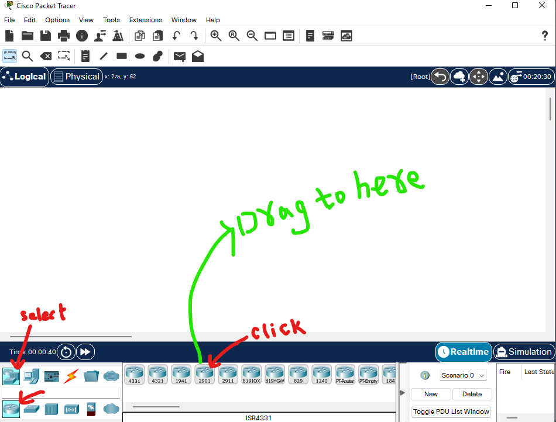 | 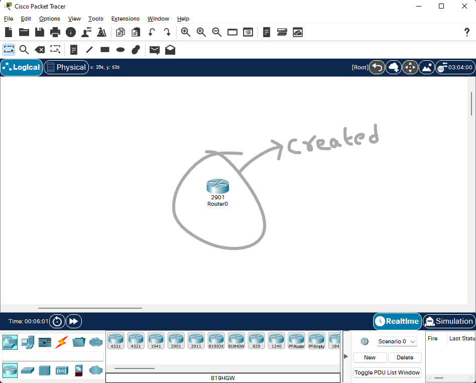 |

## Step 3: Create a 2 × Switch 2960-24TT

|          How?          |         Result         |
| :--------------------: | :--------------------: |
| 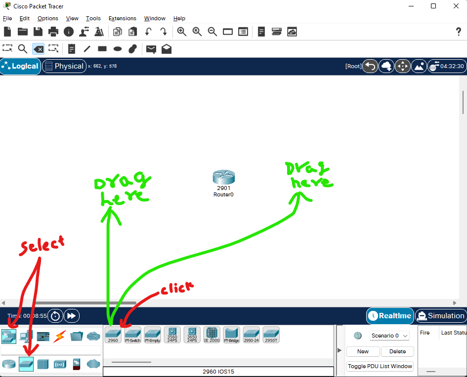 | 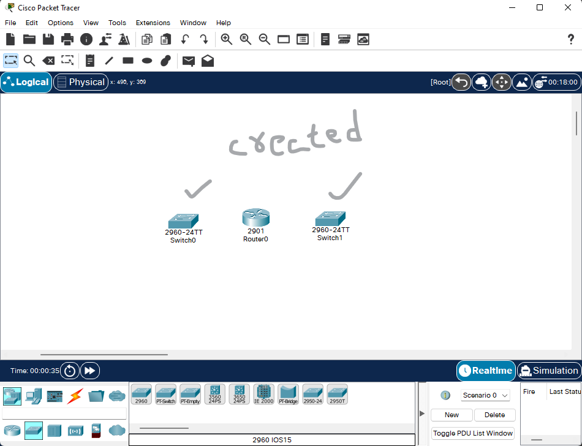 |

## Step 4: Insert 3 × Laptop and 3 × PC

|          How?          |         Result         |
| :--------------------: | :--------------------: |
| 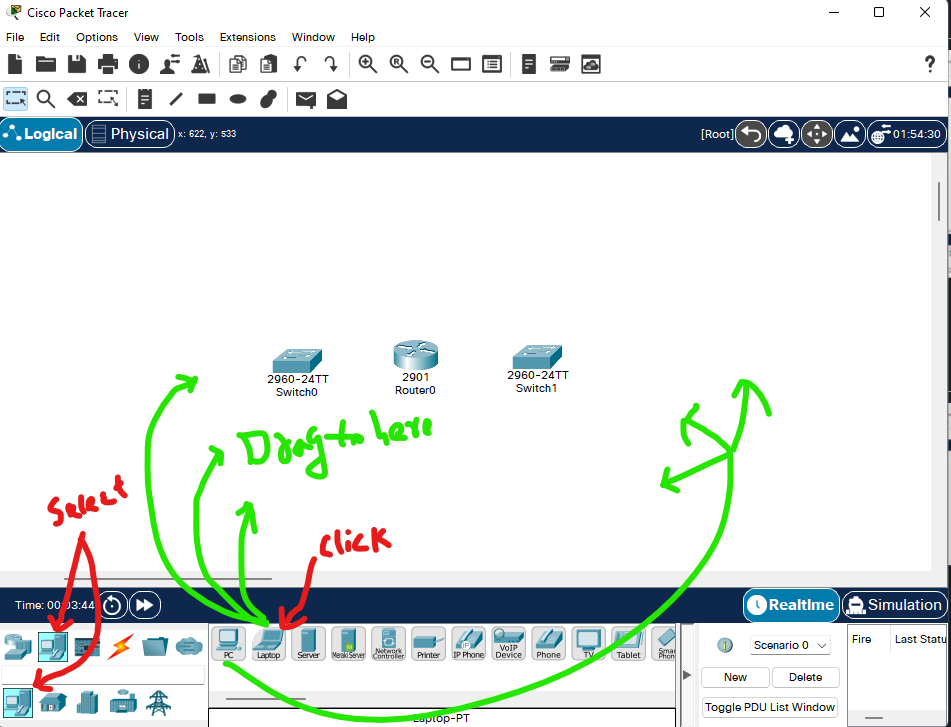 | 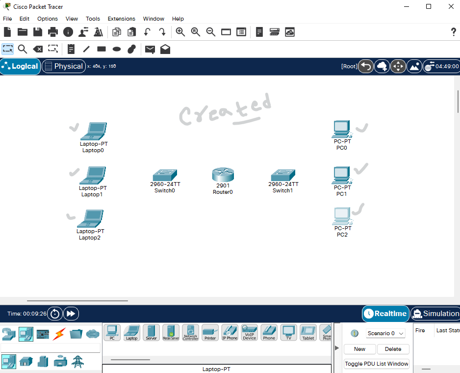 |

## Step 5:

- Connect 3 × Laptops to Switch0
- Connect 3 × PC to Switch1
- Connect Switch0 & Switch1 to Router0

|       How?        |                   |
| :---------------: | :---------------: |
| 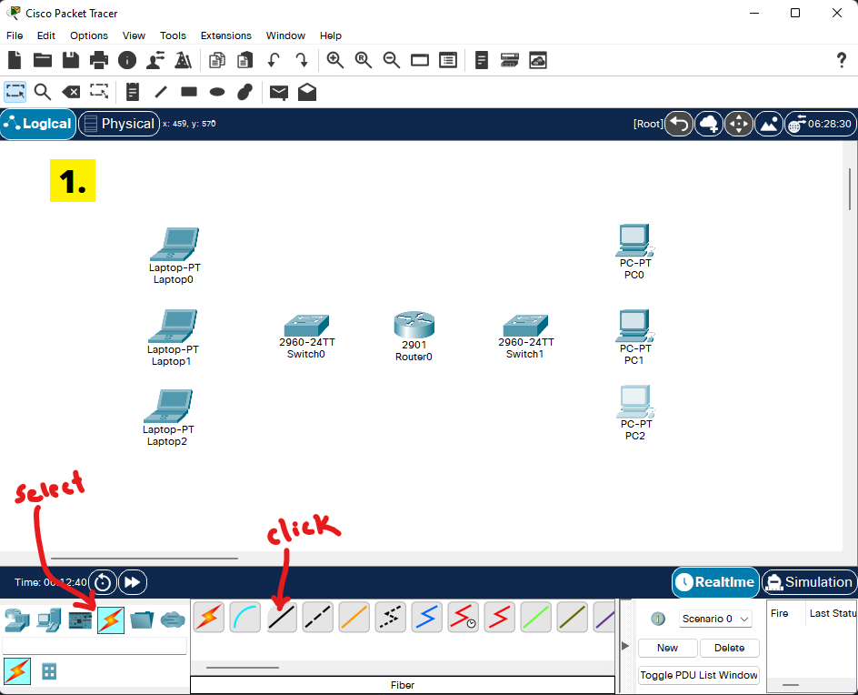 | 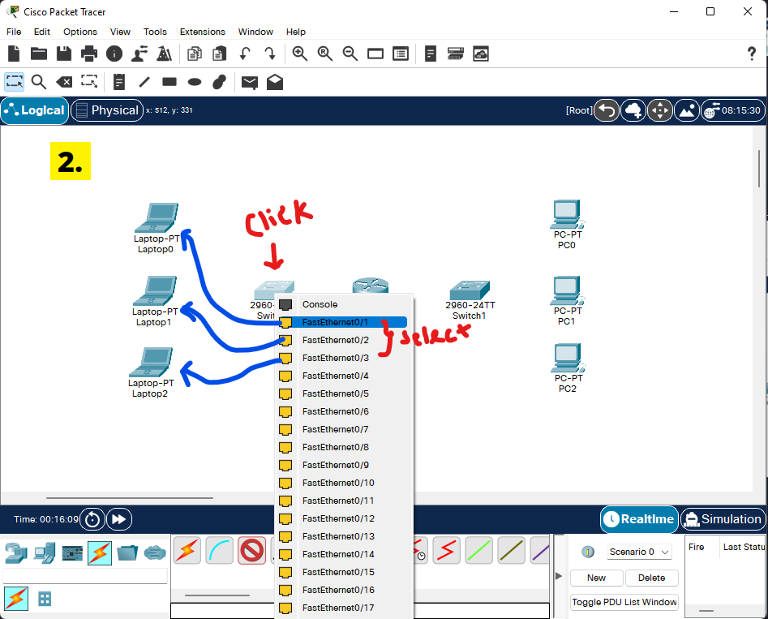 |
| 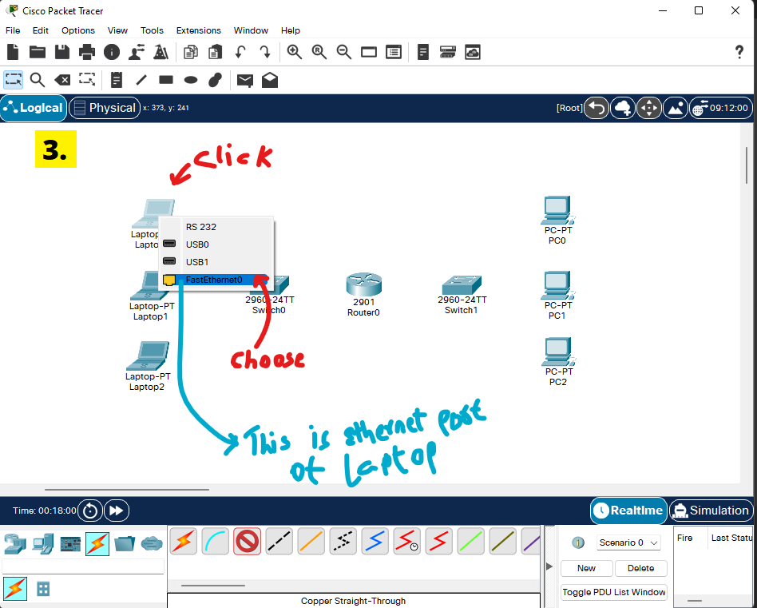 | 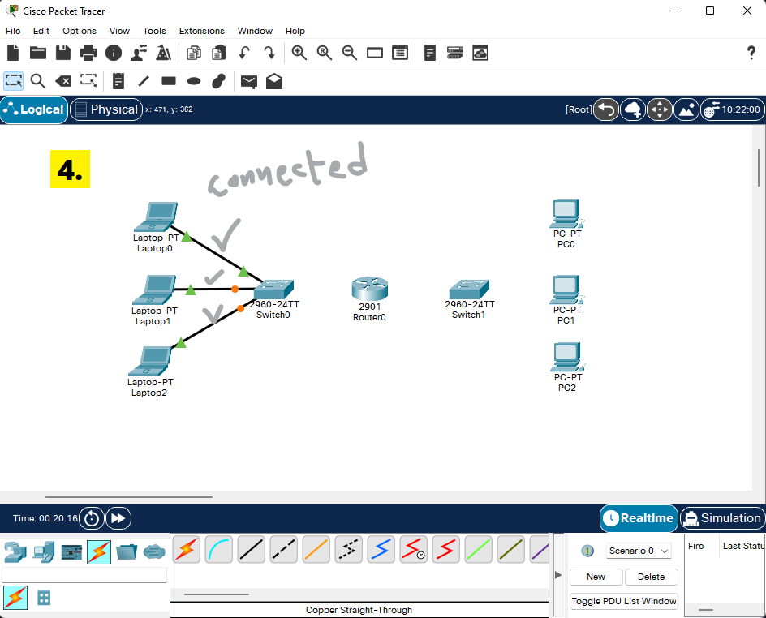 |
| 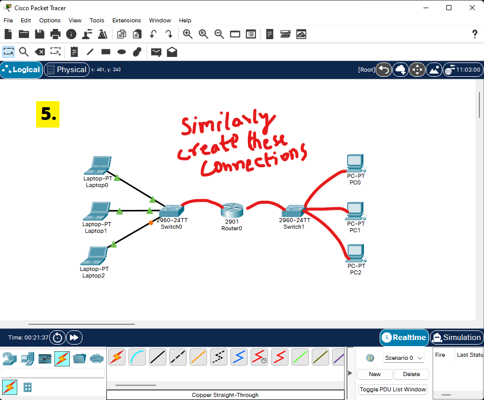 | 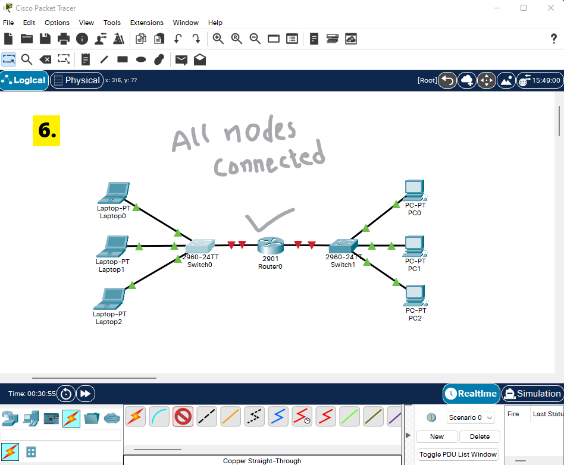 |

- Note: While connecting Switch and Router, you need to use 'GigabitEthernet' instead of 'FastEthernet'

  It looks like this:

  

## Step 6: Ping one device from another
